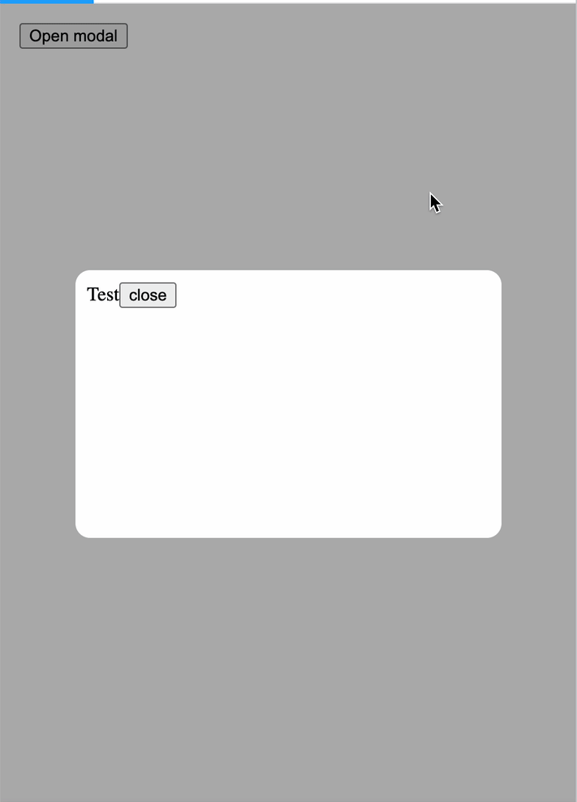

# React Full Screen Modal

## Why?

Modals typically don't work well for modals. They take up a lot of space and often squish their contents.

This library aims to solve that by turning the modal into full screen after a certain break point.

## Goals

1. Do one thing - Modal on desktop, full screen on mobile
2. Do what you want - Outside of basic animations and modal utilities, this does nothing more and nothing less than Goal #1
3. Simple API

## Demo



## Props

- **isOpen**: `boolean` - Determines whether the modal is open. \*
- **children**: `React.ReactNode` - Children components of modal. \*
- **overlay**: `boolean` - Determines whether or not to have a background overlay for desktop modal. Default: `true`
- **breakpoint**: `number` - Width of screen at which to switch between modal and full screen. Default: `350`
- **outsideClick**: `(event: MouseEvent) => void` - On click that fires when a use clicks outside of the modal (best used to close modal). Default: `noop`
- **mobileStyles**: `React.CSSProperties` - Css styles to pass to mobile full screen wrapper.
- **desktopStyles**: `{ modal: ReactCSSProperties, overlay: React.CSSProperties }` - Object that contains two properties of css styles to pass to the modal or overlay components.

_\* Required props_

## Example

```Javascript
export const Test1 = () => {
  const [isOpen, setIsOpen] = useState(false)

  return (
    <>
      <button onClick={() => setIsOpen((o) => !o)}>Open modal</button>
      <Modal
        isOpen={isOpen}
        outsideClick={() => {
          setIsOpen(false)
        }}
      >
        <div style={{ height: 200, width: 330, padding: 10 }}>
          Test
          <button onClick={() => setIsOpen(false)}>close</button>
        </div>
      </Modal>
    </>
  )
}
```
